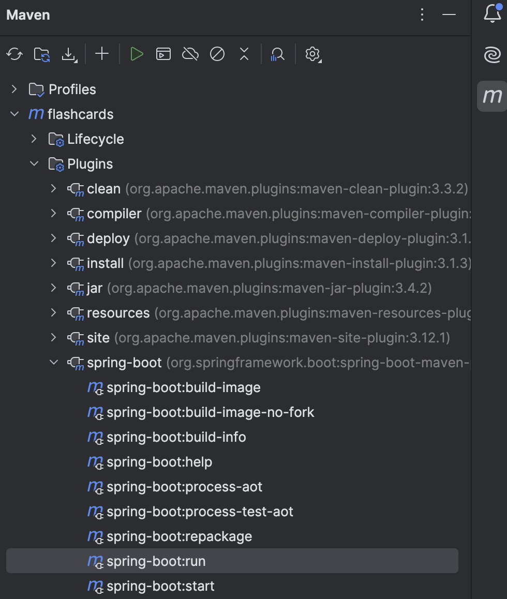
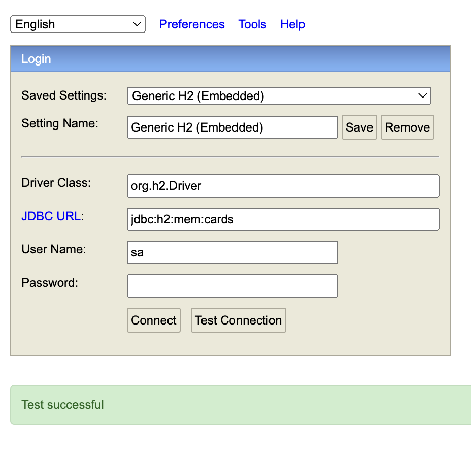

https://github.com/danvega/fcc-spring-boot-3  
https://www.youtube.com/watch?v=31KTdfRH6nY&t=4145s  
2:13:00

- `./mvn spring-boot:run`  
- `CommandLineRunner` is functional interface  
- Functional interface in Java is an interface that has a single abstract method, which in my case is method `card` inside the Application. Because it's functional interface, it can be used as lambda expression. Therefor no need to implement class




`bean` a instance of the class with some metadata around it
### In Detail
_CardController.java_
```
public void saveAll(List<Card> cards) {
        cards.stream().forEach(this::create);
    }
```
1. `public void saveAll(List<Card> cards)`
   - `public` make the method accessible from outside the class
   - `void` specifies the method's return value, which in this case is nothing
   - `saveAll` method's name
   - `List<Card>` array that contains `Card` objects
2. `cards.stream()`
    - In Java, `List` has a `stream()` method that returns a Stream
    - Streams in Java are similar to arrays in JS, but with more powerful processing capabilities
3. `forEach(this::create)`
    - `forEach` is a method on the Stream that applies an operation to each element
      - `this::create` is a method reference. It's a shorthand for lambda expression.   
        Since `CardController` has methods `create`, `update`, `delete`, etc. declared, `this::create` is used in this instance.  
        Alternatively with lambda function: `cards.stream().forEach(card -> this.create(card))`

### Annotations
- `@Component`  
- `@Bean`  
- `@RestController`  
- `@GetMapping`  
- `@PostConstruct`

### In memory DB
_application.properties_:
```
# by default the data source name is uuid
spring.datasource.generate-unique-name=false
spring.datasource.name=cards
```
_http://localhost:8080/h2-console_:
